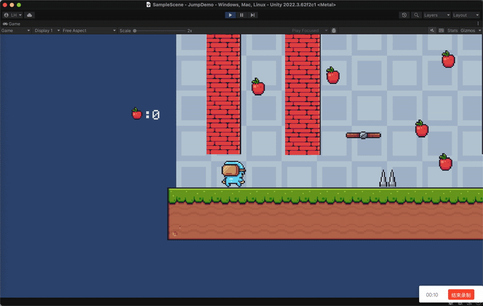

# 像素冒险 (Pixel Adventure) - Unity 2D平台跳跃游戏

> 这是一个使用 Unity 和 C# 开发的2D平台跳跃游戏Demo。本项目旨在实践和展示Unity 2D游戏开发的核心技术，包括角色控制、场景交互和游戏流程管理。
>

---

### 核心功能 (Key Features)

- **🕹️ 精细的角色控制器 (Player Controller):**
    - 基础移动、跳跃与**二段跳**
    - **贴墙**与**墙壁缓降**
    - 高机动性的**蹬墙跳**
- **🧩 丰富的场景交互 (Scene Interaction):**
    - 可供站立的**自动移动平台**
    - 即死型**尖刺陷阱**
    - 可收集物与**计分系统**
- **♻️ 完善的游戏流程 (Game Flow):**
    - 角色死亡与重生机制
    - **检查点 (Checkpoint)** 系统，支持在检查点复活

---

### 技术栈 (Technology Stack)

- **游戏引擎:** Unity 2022.3
- **编程语言:** C#
- **开发工具:** Rider
- **版本控制:** Git

---
## 🎮 在线试玩 (Play Online)
游戏已部署至线上，点击下方链接即可在浏览器中直接体验！
 

 

> **注意:** 首次加载可能需要一些时间，请耐心等待。推荐使用 Chrome 或 Firefox 浏览器以获得最佳体验。

## 🎮 下载试玩体验 (Playable Demo)

我已将游戏打包为 macOS版本，您可以点击下方对应的链接下载体验，若你的设备不支持macos版本，也可以进行在线体验

**说明:** 下载压缩包后，解压文件夹，运行其中的可执行文件即可。
 

 
> **注意:** 如果下载速度慢，你可能需要使用科学上网工具。
>
> 如果你对项目感兴趣，欢迎查看我的 [已知问题列表与未来计划](#已知问题-known-issues--未来计划-future-plans)！
